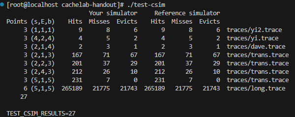
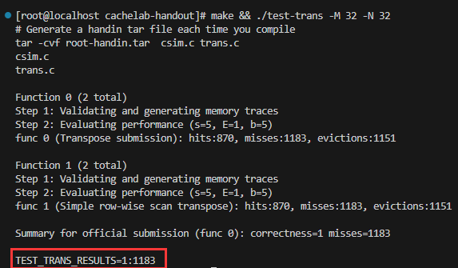
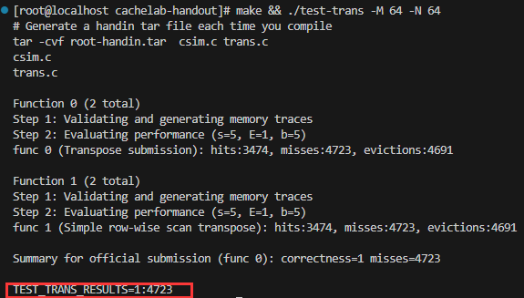
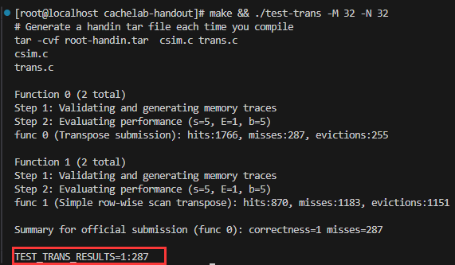

# CacheLab

实验目的：

1、理解高速缓存cache，掌握内存操作指令，理解LRU策略。

2、掌握最小化高速缓存的不命中的次数。

文件说明：

 

实验分为两部分：

Part A要求根据traces中的内存操作文件，编写一个高速缓存模拟器（csim.c）

Part B要求优化矩阵转置函数，最小化高速缓存的不命中的次数（trans.c）

缓存存入内存地址的原理：

 


## Part A

### 预备理论

 

本实验中采用的是Set associative形式(set为1时就是Direct mapped)存储数据，其存储结构如下：

 

在本实验中，内存操作格式为：`[space]operation address, size`

operation 有 4 种：

- `I` 表示加载指令，表示从内存中读取指令内容
- `L`加载数据，表示程序从某个内存地址加载了数据。（缓存命中、不命中、执行替换策略）
- `S` 存储数据，表示程序向某个内存地址存储了数据。（写回、写分配）
- `M` 修改数据，表示程序对某个内存地址的数据进行了修改。

不需要考虑加载指令`I`,`M`指令相当于先进行`L`再进行`S`，模拟器要做出的反馈有 3 种：

- `hit`：命中，表示要操作的数据在对应组的其中一行
- `miss`：不命中，表示要操作的数据不在对应组的任何一行
- `eviction`：驱逐，表示要操作的数据的对应组已满，进行了替换操作

### PartA的主要操作

编写csim.c，这个程序的执行效果要与csim-ref相同，能够模拟一个高速缓存器（参数自定义），执行traces/xx.trace中的内存操作过程。这个模拟器不需要真的存储数据，只是计算traces/xx.trace的内存操作过程中，缓存的命中、不命中、LRU替换的数量，然后将这些参数作为答案，传给printSummary函数。

### 思路

1、创建高速缓存：这包括从命令行中读取参数信息，初始化缓存
2、读入内存操作：就是读取xx.trace文件中每行的内容
3、根据读入的内存操作，模拟高速缓存的行为：核心代码，这包括在高速缓存中查找地址所指示的字，对不命中的处理（是加载到一个空的缓存行还是需要执行LRU替换策略）。每次执行一次缓存(caching)，就更新缓存(cache)信息（有效位、标志位、时间戳），同时统计hit、miss、eviction

#### 创建高速缓存  

利用二维结构体数组实现cache line定义：

```
typedef struct
{
    bool valid; //有效位
    unsigned long tag;  //标志位
    int timestamp;  //时间戳
}cache_line;    //一个高速缓存行
```

从Linux命令行中读取参数信息，并初始化cache：

```
cache_line** create_cache(int argc, char** argv){
    int opt;
    while(-1 != (opt = getopt(argc, argv, "vs:E:b:t:"))){
        switch(opt){
            case 'v':
                verbose = 1;    //设置verbose为1，表示详细输出缓存过程
                break;
            case 's':
                s = atoi(optarg); //组数 2 ^ s
                break;
            case 'E':
                E = atoi(optarg);	//缓存行数
                break;
            case 'b':
                b = atoi(optarg);
                break;
            case 't':
                strcpy(t, optarg);
                break;
            default:
                break;  //程序健壮性检验，如果不是一个合法的参数，就会退出switch,继续while读取
        }
    }

    int row = pow(2, s);
    int col = E;
    cache_line** cache = (cache_line)malloc(row * sizeof(cache_line*));  //动态内存分配
    if(cache == NULL)
    {
        printf("Failed to allocate memory!\n");
        exit(1);
    }
    for(int i = 0; i < row; i ++){
        cache[i] = (cache_line*)malloc(col * sizeof(cache_line));
        if(cache[i] == NULL)
        {
            printf("Failed to allocate memory!\n");
            exit(1);
        }
    }
    //初始化，有效位为0，时间戳为0
    for(int i = 0; i < row; i ++){
        for(j = 0; j < col; j ++){
            cache[i][j].valid = 0;
            cache[i][j].timestamp = 0;
        }
    }
    return cache;
}
```

#### 读入.trace文件中的内存操作

**读取文件`t`的每一行**，对指令进行解析，然后获取地址映射的组索引、标记，用于后续在模拟高速缓存时，在高速缓存中查找这个地址的内容

使用课件中建议的`fscanf`函数，读取文件`t`的每一行指令。

```
void get_trace(cache_line** cache){
    FILE *fp = fopen(t, "r");
    if(fp == NULL){
        perror("Error opening file")
        exit(1);
    }

    char operation;
    unsigned long addr;
    int bytes; n 
    int set;
    unsigned long tag;

    while(fscanf(fp, " %c %lx,%d", &operation, &addr, &bytes) == 3){
        set = (addr>>b) & (unsigned long)((1<<s)-1);
        tag = addr >> (b+s);
        switch(operation)
        {
            case 'L':
            case 'S':
                if(verbose) printf("%c %lx,%d ", operation, addr, bytes);
                cache_simulate(cache, set, tag);
                if(verbose) printf("\n");
                break;
            case 'M':
                if(verbose) printf("%c %lx,%d ", operation, addr, bytes);
                cache_simulate(cache, set, tag);
                cache_simulate(cache, set, tag);
                if(verbose) printf("\n");
                break;
            default:
                break;
        }
    }
}
```

#### 模拟高速缓存

根据从内存操作中由地址映射的组索引 `set`、标记`tag`，模拟缓存过程

为了简化参数，我使用一个数组`result[3]`来存放`hit`、`miss`、`eviction`的次数。

为了记录缓存行`cache[i][j]`最后被执行的时间，即**设置时间戳**`cache[i][j].timestamp`，我使用一个全局变量`T`作为整体的时间。初始`T`设置为`0`，每当进行一次缓存(caching)，就要对`T`加`1`，这样当需要进行LRU替换时，我们**遍历查找这个组，驱逐时间戳最小的缓存行**。恰好我们在每一次缓存(caching)后，使用`update`函数更新缓存(cache)的信息，所以当调用`update`函数时，就意味着进行了一次缓存(caching)，因此可以在`update`函数中对`T`加`1`，更新整体的时间。

##### 行匹配

遍历检查缓存行`cache[set][j]`的有效位和标记位，以确定地址中的字是否在缓存中。如果找到了一个有效的行`cache[set][pos]`，它的标记与地址中的标记`tag`相匹配，则**缓存命中**；若遍历了所有的行都不匹配，则为**缓存不命中**

  ```
  void cache_simulate(cache_line** cache, int set, unsigned long tag){
      bool find = false;   //标识是否缓存命中
      int col = E;
      int pos = 0;
      //缓存命中
      for(int j = 0; j < col; j ++){
          if(cache[set][j].valid == 1 && cache[set][j].tag == tag){
              pos = j;
              update(cache[set], HIT, pos, tag);
              find = true;
              break;
          }
      }
      //缓存未命中，先用一个数组occupancy表示cache[set]中缓存行数目
      if(!find){
          if(occupancy[set] != E){
              occupancy[set] ++;
              for(int j = 0; j < col; j ++){
                  if(cache[set][j].valid == 0){   
                      pos = j;
                      update(cache[set], MISS, pos, tag); //将空缓存行替换为目标数据块
                      break;
                  }else{
                      pos = LRU_replace(cache[set]);  //若都有效，则用LRU策略替换
                      update(cache[set], MISS, pos, tag);
                      update(cache[set], EVICTION, pos, tag); //缓存EVICTION
                  }
              }
          }
      }
  }
  
  void update(cache_line* cache_set, enum Category category, int pos, int tag){
  
      result[category] ++;
      printf("%s ", category_string[category]);
      cache_set[pos].tag = tag;
      cache_set[pos].valid = 1;
      cache_set[pos].timestamp = T;
      T ++;
  }
  
  //遍历得出时间戳最小的缓存行pos
  int LRU_replace(cache_line* cache_set){
      int min = cache_set[0].timestamp;
      int pos = 0;
      for(int j = 1; j < E; j ++){
          if(cache_set[j].timestamp < min){
              pos = j;
              min = cache_set[j].timestamp;
          }
      }
      return pos;
  }
  
  //释放内存
  void destory(cache_line** cache){
      int row = pow(2, s);
      for(int i = 0; i < row; i ++){
          free(cache[i]);
      }
      free(cache);
  }
  ```

### 实验结果

 

## Part B

### 预备理论

- 矩阵分块转置技术：将一个矩阵分为不同大小的块再进行转置。
- C语言中二维数组在内存中是逐行连续存储的，读取`A[0][0]`时，`A[0][1]`,`A[0][2]`等也会按行被加载进缓存，但是写入`B[0][0]`时，`B[1][0]`，`B[2][0]`并不在相邻的内存地址块中，因此可能造成缓存不命中。

### Part B的主要操作

在`trans.c`中，使用分块技术优化矩阵转置函数，处理三个不同的输入`32 * 32`,`64 * 64`,`61 * 67`，你要将优化后的函数写到`transpose_submit`函数里。

### 实验说明

1、只运行使用最多12个int局部变量

2、不能使用递归函数

3、不能对原始的矩阵A进行修改

4、不能通过malloc申请空间

5、测试的高速缓存架构为`s = 5, E = 1, b = 5`，`b = 5`表示每个缓冲行能存32个字节，即8个int数据（c语言）

6、优化目标：

```
32x32 : miss < 300

64x64 : miss < 1300

61x67 : miss < 2000
```

#### 原始转置方法测试

实验提供了一个原始的矩阵转置代码如下：

```
void trans(int M, int N, int A[N][M], int B[M][N])
{
    int i, j, tmp;

    for (i = 0; i < N; i++) {
        for (j = 0; j < M; j++) {
            tmp = A[i][j];
            B[j][i] = tmp;
        }
    }    

}
```

矩阵A按行优先读取，矩阵B按列优先写入，因此对于矩阵B会有相当多的缓存未命中。

##### 测试结果

32x32:

 

64x64:

 

61x67:

 

#### 32x32 矩阵转置优化

性能瓶颈：32x32矩阵B用原始方法对缓存的利用率很低，每次缓存组只存放B中一个元素，而且在后续访问这一列时，这个元素就被驱逐了，造成了每个元素读取一次，就会发生一次不命中的情况。而分块的核心思想就是：将一个程序中的数据结构组织成大的片（Chunk），使得能够将一个片加载到高速缓存中，并在这个片中多次进行读写，提高对缓存的利用率，分块技术正好对症！

**将32x32矩阵分块为16个8x8数据块**以减少矩阵B列优先写入的缓存miss。除此之外，用**局部变量存储8个对应的A矩阵的值**，以减少对角线块上的缓存冲突miss，对应代码如下：

```
void transpose_submit(int M, int N, int A[N][M], int B[M][N])
{
    //由于对角线部分的冲突不命中增多，导致miss的数量较大，使用的方法是将A中的一组元素（8个）使用局部变量存储在程序寄存器中，避免了A和B的加载和写回的冲突不命中
    int a0, a1, a2, a3, a4, a5, a6, a7;
    for(int i=0; i<N; i+=8)
    {
        for(int j=0; j<M; j+=8)
        {
             //将一组的8个Aij都存放到寄存器文件中，然后直接传递给Bji，对于对角线元素虽然仍有冲突，但是除此之外，对角线块不会出现冲突
            //估计约287misses（256+31），这种方法只有处在对角线上的元素会出现冲突
            for(int k=0; k<8; ++k)
            {
                a0 = A[i+k][j+0];
                a1 = A[i+k][j+1];
                a2 = A[i+k][j+2];
                a3 = A[i+k][j+3];
                a4 = A[i+k][j+4];
                a5 = A[i+k][j+5];
                a6 = A[i+k][j+6];
                a7 = A[i+k][j+7];

                B[j+0][i+k] = a0;
                B[j+1][i+k] = a1;
                B[j+2][i+k] = a2;
                B[j+3][i+k] = a3;
                B[j+4][i+k] = a4;
                B[j+5][i+k] = a5;
                B[j+6][i+k] = a6;
                B[j+7][i+k] = a7;
            }
            
        }
    }
}

```

##### 优化结果

 

287 < 300，大幅缩小了未命中次数

#### 64x64 矩阵转置优化

延续之前的思路，为了提高矩阵B的缓存利用率，先尝试用4x4的方块优化：

 

性能瓶颈：对于A中每一个操作块，只有每一行的第一个元素会不命中，所以为4次不命中；对于B中每一个操作块，只有每一列的第一个元素会不命中，所以也有4次不命中。使用4×4分块，确实避免了块内部的冲突，但是浪费了每个缓存块中其他4个元素的空间，这会导致不命中率增加——每加载 或 存储4个元素，就有1次miss。而使用8×8分块，在块内部不冲突的前提下，每加载 或 存储8个元素，才有1次miss

优化策略：虽然4×4的方法还有不尽人意的地方，但是它给了我启发：可以尝试先存储B中8×8块的前4行，当所有转置的结果都存放到B的前4行时，再对后4行存储。关键在于不要使B的块因为上下4行的组索引相同的原因，导致被来回替换。即先分成8x8后4x4再分块。

```
void transpose_64x64(int M, int N, int A[N][M], int B[M][N])
{
    int a_0, a_1, a_2, a_3, a_4, a_5, a_6, a_7;
    for (int i = 0; i < 64; i += 8){
        for (int j = 0; j < 64; j += 8){
            for (int k = i; k < i + 4; k++){
                // 得到A的第1,2块
                a_0 = A[k][j + 0];
                a_1 = A[k][j + 1];
                a_2 = A[k][j + 2];
                a_3 = A[k][j + 3];
                a_4 = A[k][j + 4];
                a_5 = A[k][j + 5];
                a_6 = A[k][j + 6];
                a_7 = A[k][j + 7];
                // 复制给B的第1,2块
                B[j + 0][k] = a_0;
                B[j + 1][k] = a_1;
                B[j + 2][k] = a_2;
                B[j + 3][k] = a_3;
                B[j + 0][k + 4] = a_4;
                B[j + 1][k + 4] = a_5;
                B[j + 2][k + 4] = a_6;
                B[j + 3][k + 4] = a_7;
            }
            for (int k = j; k < j + 4; k++){
                // 得到B的第2块
                a_0 = B[k][i + 4];
                a_1 = B[k][i + 5];
                a_2 = B[k][i + 6];
                a_3 = B[k][i + 7];
                // 得到A的第3块
                a_4 = A[i + 4][k];
                a_5 = A[i + 5][k];
                a_6 = A[i + 6][k];
                a_7 = A[i + 7][k];
                // 复制给B的第2块
                B[k][i + 4] = a_4;
                B[k][i + 5] = a_5;
                B[k][i + 6] = a_6;
                B[k][i + 7] = a_7;
                // B原来的第2块移动到第3块
                B[k + 4][i + 0] = a_0;
                B[k + 4][i + 1] = a_1;
                B[k + 4][i + 2] = a_2;
                B[k + 4][i + 3] = a_3;
            }
            for (int k = i + 4; k < i + 8; k++)
            {
                // 处理第4块
                a_4 = A[k][j + 4];
                a_5 = A[k][j + 5];
                a_6 = A[k][j + 6];
                a_7 = A[k][j + 7];
                B[j + 4][k] = a_4;
                B[j + 5][k] = a_5;
                B[j + 6][k] = a_6;
                B[j + 7][k] = a_7;
            }
        }
    }
}
```

##### 优化结果

 

#### 61x67 矩阵转置优化

**性能分析：**因为是不规则的矩阵，因此缓存区必定有未填满的set组。矩阵每隔一行相差9组。这里引入16x16分块，刚好满分。

```
void transpose_submit(int M, int N, int A[N][M], int B[M][N])
{
     for (int i=0; i<N; i+=16)
     {
         for(int j=0; j<M; j+=16)
         {
             for(int k=i; k<i+16 && k<N; ++k)
             {
                 for(int s=j; s<j+16 && s<M; ++s)
                 {
                     B[s][k] = A[k][s];
                 }
             }  
         }
     }
}
```

##### 优化结果

 
