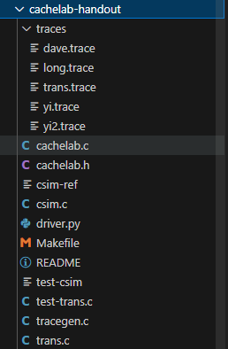
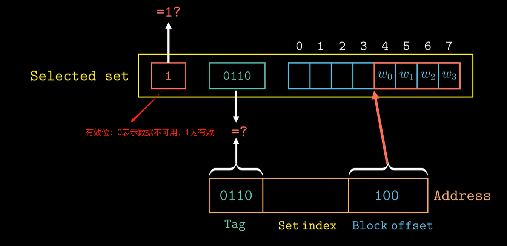
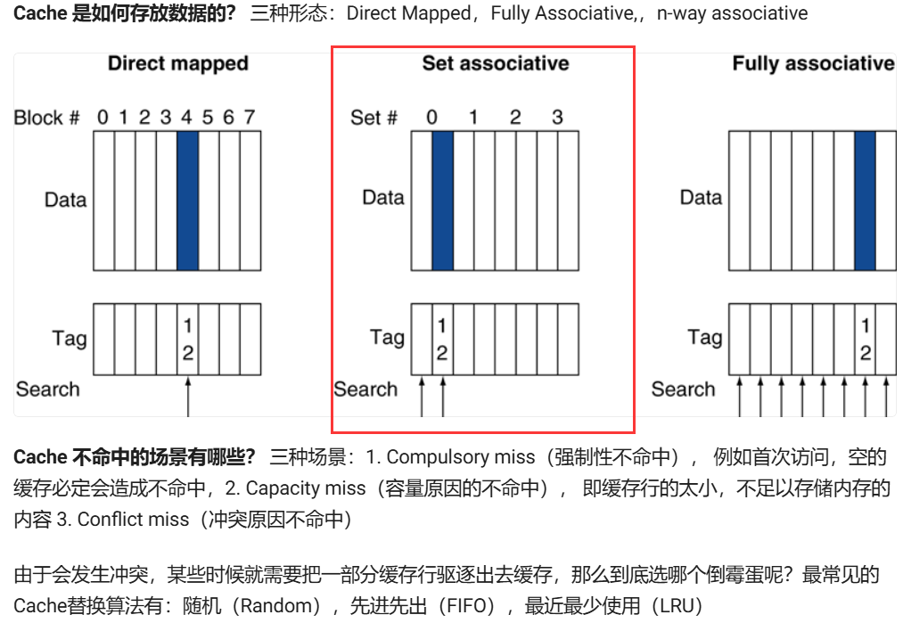
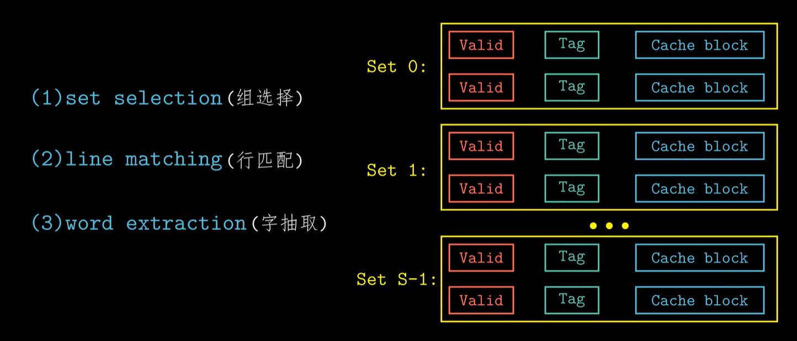

# CacheLab

实验目的：

1、理解高速缓存cache，掌握内存操作指令，理解LRU策略。

2、掌握最小化高速缓存的不命中的次数。

文件说明：

 

实验分为两部分：

Part A要求根据traces中的内存操作文件，编写一个高速缓存模拟器（csim.c）

Part B要求优化矩阵转置函数，最小化高速缓存的不命中的次数（trans.c）

缓存存入内存地址的原理：

 


## Part A

### 预备理论：

 

本实验中采用的是Set associative形式(set为1时就是Direct mapped)存储数据，其存储结构如下：

 

在本实验中，内存操作格式为：`[space]operation address, size`

operation 有 4 种：

- `I` 表示加载指令，表示从内存中读取指令内容
- `L`加载数据，表示程序从某个内存地址加载了数据。（缓存命中、不命中、执行替换策略）
- `S` 存储数据，表示程序向某个内存地址存储了数据。（写回、写分配）
- `M` 修改数据，表示程序对某个内存地址的数据进行了修改。

不需要考虑加载指令`I`,`M`指令相当于先进行`L`再进行`S`，模拟器要做出的反馈有 3 种：

- `hit`：命中，表示要操作的数据在对应组的其中一行
- `miss`：不命中，表示要操作的数据不在对应组的任何一行
- `eviction`：驱逐，表示要操作的数据的对应组已满，进行了替换操作

### PartA的主要操作：

编写csim.c，这个程序的执行效果要与csim-ref相同，能够模拟一个高速缓存器（参数自定义），执行traces/xx.trace中的内存操作过程。这个模拟器不需要真的存储数据，只是计算traces/xx.trace的内存操作过程中，缓存的命中、不命中、LRU替换的数量，然后将这些参数作为答案，传给printSummary函数。

### 思路

1、创建高速缓存：这包括从命令行中读取参数信息，初始化缓存
2、读入内存操作：就是读取xx.trace文件中每行的内容
3、根据读入的内存操作，模拟高速缓存的行为：核心代码，这包括在高速缓存中查找地址所指示的字，对不命中的处理（是加载到一个空的缓存行还是需要执行LRU替换策略）。每次执行一次缓存(caching)，就更新缓存(cache)信息（有效位、标志位、时间戳），同时统计hit、miss、eviction

#### 创建高速缓存  

利用二维结构体数组实现cache line定义：

```
typedef struct
{
    bool valid; //有效位
    unsigned long tag;  //标志位
    int timestamp;  //时间戳
}cache_line;    //一个高速缓存行
```

从Linux命令行中读取参数信息，并初始化cache：

```
cache_line** create_cache(int argc, char** argv){
    int opt;
    while(-1 != (opt = getopt(argc, argv, "vs:E:b:t:"))){
        switch(opt){
            case 'v':
                verbose = 1;    //设置verbose为1，表示详细输出缓存过程
                break;
            case 's':
                s = atoi(optarg);
                break;
            case 'E':
                E = atoi(optarg);
                break;
            case 'b':
                b = atoi(optarg);
                break;
            case 't':
                strcpy(t, optarg);
                break;
            default:
                break;  //程序健壮性检验，如果不是一个合法的参数，就会退出switch,继续while读取
        }
    }

    int row = pow(2, s);
    int col = E;
    cache_line** cache = (cache_line)malloc(row * sizeof(cache_line*));  //动态内存分配
    if(cache == NULL)
    {
        printf("Failed to allocate memory!\n");
        exit(1);
    }
    for(int i = 0; i < row; i ++){
        cache[i] = (cache_line*)malloc(col * sizeof(cache_line));
        if(cache[i] == NULL)
        {
            printf("Failed to allocate memory!\n");
            exit(1);
        }
    }
    //初始化，有效位为0，时间戳为0
    for(int i = 0; i < row; i ++){
        for(j = 0; j < col; j ++){
            cache[i][j].valid = 0;
            cache[i][j].timestamp = 0;
        }
    }
    return cache;
}
```

### 读入.trace文件中的内存操作

**读取文件`t`的每一行**，对指令进行解析，然后获取地址映射的组索引、标记，用于后续在模拟高速缓存时，在高速缓存中查找这个地址的内容

使用课件中建议的`fscanf`函数，读取文件`t`的每一行指令。

